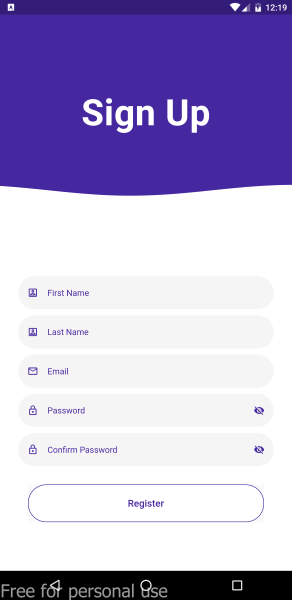

# Animated_Flutter_Login_Screen
Chavez, Hugo Leroy //
Gicanal, Flora May // 
Tunggak, Marianne Therese
#
A login page with simple animation.

This project contains the basic features of Flutter Animation that are required to build an amazing Flutter application. 

The login button works by entering an email address and a password (atleast 8 characters and a maximum of 16)

## Below are the screen shots of the login page:

## Login Page
#

## Some Errors
#

#

#

## Sign Up Page
#

## Forgot Password Page
#

## Home Page
#
